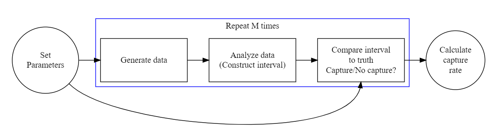

---
title: "08-coverage-probability"
date: "10/18/2019"
author: "Yasi Wang"
output: 
  html_notebook: 
    highlight: tango
    theme: cerulean
--- 

# Introduction
***

## Confidence Interval
Many of us may heard of confidence interval (CI). It is an interval estimate that potentially contains the population parameter. A confidence interval for a parameter is derived by approximating the sampling distribution of a statistic. 

Due to sampling variation, the confidence interval for some sample distributions might not contain the parameter. Thus, there is always a proportion for the possible confidence intervals that contain the true value of the unknown population parameter. It is called confidence level. For example, a 95% confidence interval means that if you collect a large number of samples and construct the corresponding confidence intervals, then about 95% of the intervals will contain the parameter.

## Coverage probability

Coverage probability is an important operating characteristic of methods for constructing interval estimates, particularly confidence intervals. The coverage probability for CI is the proportion of intervals that capture the population parameter of interest. Conceptualy, we can calculate the coverage probability with the following steps: 

- generate a sample of size *N* from a known distribution
- construct a confidence interval
- determine if the confidence captures the population parameter
- repeat steps (1) - (3) many times. Estimate the coverage probability as the proportion of samples for which the confidence interval captured the population parameter.

In this blog, I will demonstrate the simulation to calculate the coverage probability of the 95% confidence interval of the median when computed from *F&#770;*<sub>*X*</sub><sup>*m**l**e*</sup>. We define the 95% confidence interval of the median to be the middle 95% of sampling distribution of the median.

# Simulation
***
**Step 1: Generate a single sample from a standard normal distribution of size N = 201 using MLE estimate.**

```{r include=FALSE}
require(stats4)
library(tidyverse)
```
For standard normal distributions, the maximum likelihood estimation (MLE) has the specific algorithms. It is listed below.

<center>
{ width=40% } 
</center>

```{r}
set.seed(1234)
N <- 201
pop.mean <- 0

pop.sample <- rnorm(N, pop.mean, 1) # population sample
mle.sd <- sqrt(((N-1)/N)*var(pop.sample))
mle.mean <- mean(pop.sample)

```

```{r}
mle.sd
mle.mean
```

Thus, we can know that if we use MLE estimate, sd = 1.016 and mean = -0.055 are most likely to characterise a given set of sample. 


**Step 2: Approximate the sampling distribution of the median, conditional on the estimate of the distribution in the previous step.**

If we run 5000 times using the estimated distribution calculated above, we can get the sampling distributions of median.

```{r}
meds <- rep(NA, 5000)

for (i in seq_along(meds)) {
  meds[i] <- median(rnorm(201, mle.mean, mle.sd))
}

hist(meds, breaks = 30, freq = FALSE)
lines(density(meds), ylab = "Density", col = "blue", lwd = 2.5)
```
The result shows that the medians are almost normally distributed.


**Step 3: Calculate a 95% confidence interval from the approximated sampling distribution.**

For symmetric sampling distribution, CI often has the form m ± w(&alpha;, n). m is an unbiased estimate of the parameter and w(&alpha;, n) is a width that depends on the significance level &alpha;, the sample size n, and the estimated standard error.

In this case, in the standard normal distribution, we can know the 95% CI is definitely the interval of 2.5% quantile and 97.5% quantile of the sampling distribution.

```{r echo=TRUE, warning=FALSE}
gen.ci <- quantile(meds, c(0.025, 0.975))
```


**Step 4: Calculate the coverage probability.**

In our simulation, if 0 is inside of the calculated 95% CI, we think the median is captured by this sampling distribution. Thus, if we simply run the previous sampling distribution (with mean = mle.mean, sd = mle.sd) 100 times, the coverage probability = <sup>0 is contained in the confidence interval</sup>&frasl;<sub>total number of simulation</sub> = 1.

```{r}
capture <- NA

for (j in 1:100) {
  out <- rep(NA, 5000)
  for (i in 1:5000) {
    Fhat.sample <- rnorm(N, mean = mle.mean, sd = mle.sd) #approximate distribution for sample
    out[i] <- median(Fhat.sample)
  }
# we can go to the bootstrap ci part
  gen.ci <- quantile(out, c(0.025, 0.975))
  
  capture[j] <- (gen.ci[1] < pop.mean & gen.ci[2] > pop.mean)
}
  
round(mean(capture), 4)

```


**Step 5: Perform the simulation with bootstrap.**

In the previous step, we just use one sample to generate MLE estimate. Now we will multiple sets of samples to do MLE estimate and use boostrap to get the result. The eneral framework for simulation studies of coverage probabilities is:


<center>
{ width=80% } 
</center>

Thus, I will use the following framework to perform the simulation. 

<center>
{ width=80% } 
</center>

```{r warning=FALSE}

set.seed(13)
N <- 201
pop.mean = 0
pop.sd = 1

true.parameters <- c(N, mean = pop.mean, sd = pop.sd)

generate_data <- function(parameters){ 
  rnorm(parameters[1], parameters[2], parameters[3]) 
}

capture_median <- function(ci){
  1*(ci[1] < 0 & 0 < ci[2])
}

est.mle <- function(data) {
  mle.mean <- mean(data)
  mle.sd <- sqrt(((length(data) - 1)/length(data))*var(data))
  return (c(length(data), mle.mean, mle.sd))
}

boot.meds.ci <- function(parameters) {
  R <- 5000
  sample.meds <- NA
  
  for (i in 1:R) {
    sample.meds[i] <- parameters %>% generate_data() %>% median
  }
  quantile(sample.meds, c(0.025, 0.975))
}

```


```{r}
require(doParallel)
require(foreach)

cores_2_use <- detectCores() - 1
cl <- makeCluster(cores_2_use)
clusterSetRNGStream(cl, 2344)
registerDoParallel(cl)

captures <- foreach(
    i = 1:100
  , .combine = c
  , .packages = c('dplyr') # Need to indicate which packages
) %dopar% {
  true.parameters %>% generate_data %>% est.mle %>% boot.meds.ci %>% capture_median
} 

stopCluster(cl)
mean(captures)

```

The result shows that a 95% confidence interval will capture the population median in 98% of samples.

**Step 6: Coverage probabilities in graph.**

```{r include=FALSE}
cores_2_use <- detectCores() - 1
cl <- makeCluster(cores_2_use)
clusterSetRNGStream(cl, 2344)
registerDoParallel(cl)

ci <- foreach(
    i = 1:100
  , .combine = c
  , .packages = c('dplyr') # Need to indicate which packages
) %dopar% {
  true.parameters %>% generate_data %>% est.mle %>% boot.meds.ci
}
stopCluster(cl)
```


```{r echo=FALSE}

quantile_matrix <- matrix(NA, nrow = 100, ncol = 2)

for (i in seq_along(ci)) {
  if (i %% 2 != 0) {
    quantile_matrix[floor(i/2) + 1, 1] <- ci[i]
  } else {
    quantile_matrix[i / 2, 2] <- ci[i]
  }
}

ci_95 <- data.frame(quantile_matrix,seq(1,100,1))
colnames(ci_95) <- c("min","max","id")

ci_95 <- ci_95 %>% 
  mutate(capture = ifelse(min < 0 & 0 < max, 1, 0))

ci_95$capture <- as.factor(ci_95$capture)

col = ifelse(ci_95$capture == 1, "blue", "red")

ci_95 %>% 
  ggplot(aes(x = id)) +
  geom_linerange(aes(ymin = min, ymax = max), col = col)+
  geom_line(y = 0, alpha = 0.8, color = "grey")+
  scale_x_continuous(breaks = seq(1,100,5))+
  scale_y_continuous(limits = c(-0.5,0.5))+
  coord_flip()+
  theme_light()+
  theme(panel.grid = element_blank()) +
  labs(y = "Pop.parameter of interest", x = "Sample")
```
The graph shows that the 95% confidence interval calculated for a 100 sample distributions. Intervals in blue capture the population parameter of interest; intervals in red do not.


